# AI 辅助导游面试评分系统 · 需求设计文档（PRD + 技术方案）

> 版本：v1.0 ｜ 适用：产品评审 / 技术评审 / AI 算法评审 / 项目立项 / 开发实施
> 定位：AI 仅提供**评分建议**，最终评分由评委确认；所有分数必须**可解释、可追溯**。

---

## 目录

1. 产品需求设计
2. 多语种与多模态识别设计
3. AI 评分引擎设计
4. 视频分析能力设计
5. 语音分析能力设计
6. 讲解内容分析能力设计（LLM + RAG）
7. 问答评分能力设计
8. RAG 知识库设计
9. Prompt 工程设计
10. AI 评分校准机制
11. AI 可解释性与证据链设计
12. 技术架构设计（Mermaid）
13. 数据库设计
14. API 设计
15. 非功能设计
16. 验收标准

---

## 1. 产品需求设计

### 1.1 目标与价值

| 角色 | 痛点 | 系统价值 |
| --- | --- | --- |
| 考务组织方 | 人工评分主观、效率低、批次不一致 | AI 辅助建议分 + 一致性校准 |
| 评委 | 重复劳动、难以留痕、争议难复核 | 结构化建议分 + 证据链一键复核 |
| 考生 | 评分不透明 | 可解释报告、改进建议 |

### 1.2 评分体系（总分 100）

| # | 维度 | 分值 | 主导模态 | 评分项 |
| --- | --- | --- | --- | --- |
| 1 | 形象礼仪 | 5 | 视频 | 形象气质(1) / 发型妆容(1) / 着装规范(2) / 表情仪态(1) |
| 2 | 语言表达 | 15 | 语音 | 语言标准(4) / 用词逻辑(5) / 流畅生动(6) |
| 3 | 专题线路讲解 | 25 | 内容 | 主题特色(6) / 线路内容(7) / 信息逻辑(6) / 生动内涵(6) |
| 4 | 旅游景区讲解 | 25 | 内容 | 景区特色(6) / 动线内容(7) / 信息逻辑(6) / 文化传达(6) |
| 5 | 服务规范问答 | 10 | 问答 | 服务流程 / 礼仪规范 / 专业知识 |
| 6 | 应变能力问答 | 10 | 问答 | 场景判断 / 合法合规 / 切实可行 |
| 7 | 综合知识问答 | 10 | 问答 | 广西文化 / 历史地理 / 民俗风情 |

等级与分值区间见各维度 Rubric（代码 `app/core/rubric.py`）。

### 1.3 核心业务流程

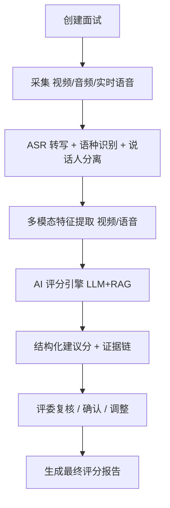

### 1.4 关键需求

- 实时评分（流式）与离线评分（录像回放）双模式。
- AI 输出：总分 / 分项分 / 扣分项 / 扣分原因 / 评分依据 / 引用证据 / 置信度。
- 每个分数可追溯：评分项 → 证据 → 转写内容 → 视频片段。
- **岗位 + 题库**：按岗位维护题库，每位考生可抽取不同题目；面试前选择岗位即生成对应试卷。
- **分数取整**：总分、分项分、扣分值一律为整数，不出现小数（评分易读、便于复核与汇总）。
- **剔除考官读题**：考官朗读题目的语音不计入考生评分，转写阶段自动识别并剔除。

### 1.5 岗位与题库设计

不同考生题目不同，按岗位维护题库；每个评分维度可配置多套候选题目，由抽题策略为考生分配。

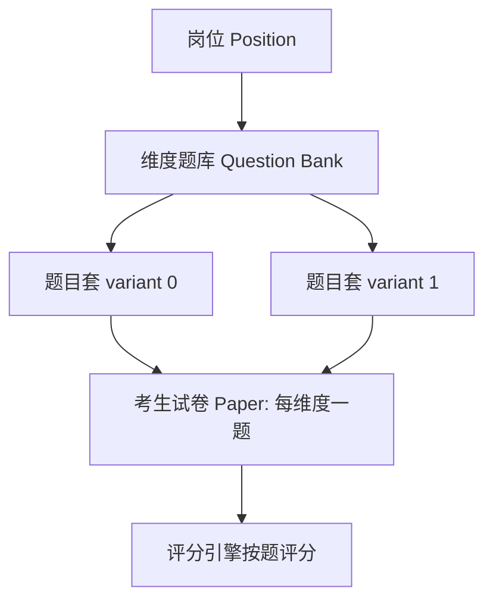

题库数据结构（JSON 示例）：

```json
{
  "position_id": "guide_zh",
  "name": "中文导游",
  "language": "zh",
  "questions": {
    "route_explanation": [
      "请设计并讲解一条'桂林山水'两日精华专题线路",
      "请设计并讲解一条'广西民族风情'专题线路"
    ],
    "contingency_qa": ["行程途中一名游客突发疾病，你将如何处置？"]
  }
}
```

接口：`GET /positions` 取岗位列表，`GET /positions/{id}/paper?variant=n` 生成某套试卷（每维度一题）。

### 1.6 评分取整规则

- 模型/引擎对每个维度输出整数分；扣分值同样取整。
- 校准约束：分数截断到 `[0, 维度满分]` 整数区间；分项之和与维度分一致；扣分之和 = 满分 − 得分。
- 总分 = 各维度整数分之和，必为整数。

---

## 2. 多语种与多模态识别设计

### 2.1 支持语言

中文普通话、英文、德语、泰语、印尼语、韩语、西班牙语、俄语、法语、日语、越南语。

要求：自动语种检测 → 自动切换 ASR 模型 → 支持中英混说 → 实时字幕 → 说话人分离。

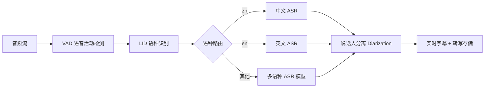

| 能力 | 选型建议 |
| --- | --- |
| 语种识别 LID | 百炼多语种模型 / Whisper-LID |
| ASR | 百炼 Paraformer 多语种、流式低延迟 |
| 中英混说 | 启用 code-switching 词典 + 混合声学模型 |
| 说话人分离 | pyannote / 阵列麦克风方位 |

### 2.2 剔除考官读题

面试中考官常朗读题目，这部分语音**不应计入考生评分**。系统在转写后、评分前做清洗：

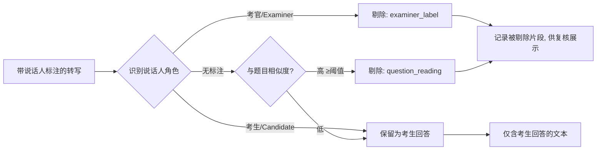

双信号识别：
1. **说话人标注**：行首「考官：」「主考官:」「Examiner:」等 → 判为考官内容。
2. **题目相似度**：无标注时，与题目高度相似的行（字符包含度/Jaccard ≥ 阈值，默认 0.8）→ 判为读题。

被剔除片段记录在 `removed_segments`（含 `reason`），随评分结果返回，供评委复核时透明展示；只有清洗后的考生回答进入评分 Prompt。实现见 `app/core/transcript.py`。生产环境结合**说话人分离 + 麦克风通道**可进一步提升准确率（考官与考生使用不同麦克风/座位方位）。

---

## 3. AI 评分引擎设计

### 3.1 引擎职责

输入（题目 + 转写 + 多模态特征 + RAG 证据）→ 按维度调用 LLM → 校准约束 → 汇总总分 + 证据链。

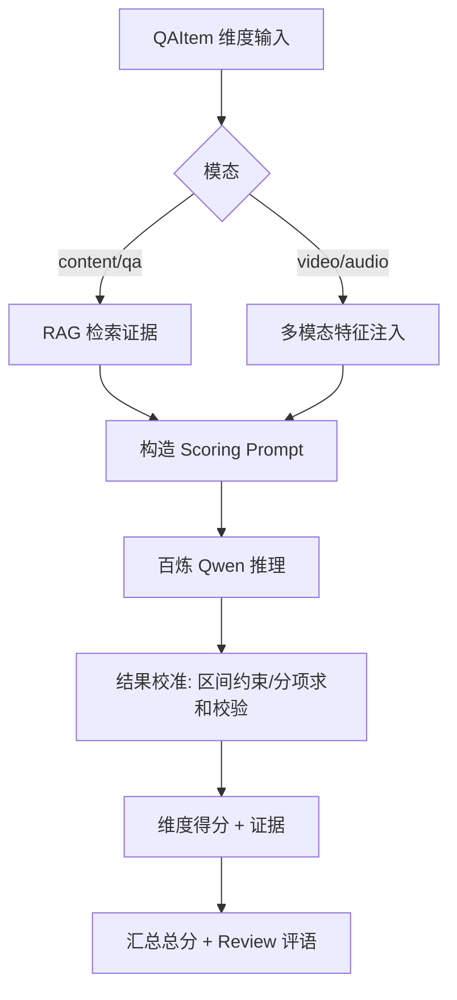

### 3.2 评分输出数据结构（JSON 示例）

```json
{
  "interview_id": "4cd469a11ab8",
  "candidate": {"name": "张三", "candidate_no": "GX2026-001", "position": "guide_zh"},
  "total_score": 78,
  "max_total": 100,
  "overall_level": "良好",
  "engine_mode": "bailian",
  "dimensions": [
    {
      "dimension_key": "knowledge_qa",
      "dimension_name": "综合知识问答",
      "question": "请介绍广西的世界遗产与国家级非物质文化遗产代表",
      "max_score": 10,
      "score": 8,
      "level": "良好",
      "items": [],
      "deductions": [
        {"reason": "未提及红色文化相关知识点", "points": 2, "evidence": "回答仅覆盖民俗与地理，无红色文化"}
      ],
      "rationale": "覆盖广西地理与民俗，逻辑清晰；红色文化要素缺失。",
      "evidence": [
        {"type": "transcript", "content": "广西是中国唯一沿海的少数民族自治区…", "ref": "00:12-00:48"},
        {"type": "rag", "content": "湘江战役纪念馆是重要红色教育基地", "ref": "KB:广西/红色文化/湘江战役"}
      ],
      "confidence": 0.86,
      "removed_segments": [
        {"text": "请介绍广西的世界遗产与国家级非物质文化遗产代表", "reason": "examiner_label"}
      ]
    }
  ],
  "review": {
    "summary": "总分 78/100，整体良好；问答类表现稳定。",
    "strengths": ["专题线路讲解"],
    "improvements": ["加强红色文化知识储备"],
    "risk_flags": []
  },
  "created_at": "2026-06-25T06:00:00Z"
}
```

---

## 4. 视频分析能力设计

| 能力 | 输出指标 | 支撑评分项 |
| --- | --- | --- |
| 人脸检测 | 是否在画面、人脸质量 | 前置校验，确保被评对象有效 |
| 姿态识别 | 站姿/坐姿稳定度 posture_score | 形象气质、表情仪态 |
| 眼神检测 | eye_contact_ratio | 表情仪态（眼神交流适度）|
| 表情识别 | smile_ratio、亲和度 | 形象气质、表情仪态 |
| 着装检测 | dress_formal、整洁/破损/污渍 | 着装规范 |
| 仪态分析 | 小动作频率、不当仪态标记 | 表情仪态 |

特征以 JSON 注入评分 Prompt：

```json
{
  "face_detected": true, "smile_ratio": 0.62, "eye_contact_ratio": 0.71,
  "posture_score": 0.8, "dress_formal": true, "grooming_clean": true,
  "improper_gesture_count": 1
}
```

映射策略：连续区间指标 → 评分项的等级映射（如 eye_contact_ratio≥0.6 视为「交流适度」），异常标记 → 触发扣分项并附帧时间戳作为证据。

---

## 5. 语音分析能力设计

| 能力 | 指标 | 转换为评分 |
| --- | --- | --- |
| 发音标准度 | GOP / 声学置信度 | 语言标准(4) |
| 语速 | 字/分钟，偏离合理区间扣分 | 流畅生动 |
| 流畅度 | 卡顿次数、重复率 | 流畅生动(6) |
| 停顿分析 | 静音时长/分布 | 流畅生动、用词逻辑 |
| 情绪分析 | 情感极性/能量 | 富有感染力 |
| 感染力分析 | 语调起伏、重音 | 流畅生动 |

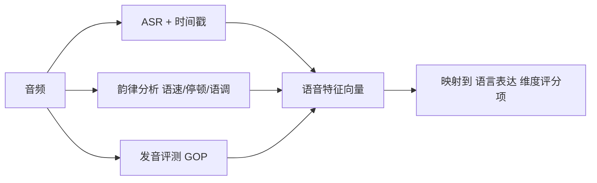

---

## 6. 讲解内容分析能力设计（LLM + RAG）

评估维度：主题鲜明度、内容完整度、信息准确性、逻辑结构、文化价值传递。

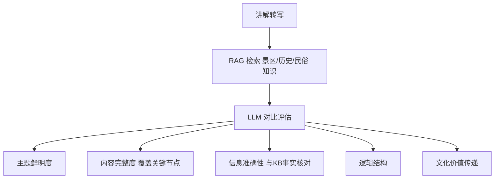

- **信息准确性**：将讲解中的事实性陈述与 RAG 检索到的知识比对，发现错误即扣分并引用 KB 证据。
- **内容完整度**：依据线路/景区的「关键节点清单」核对覆盖率。

---

## 7. 问答评分能力设计

三类问答统一流程，差异在标准答案库与 Rubric：

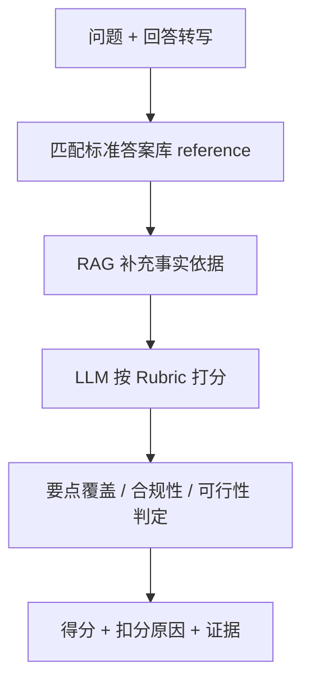

| 问答类型 | Rubric 关注点 | 标准答案库构建 |
| --- | --- | --- |
| 服务规范 | 服务流程完整、礼仪规范、专业准确 | 服务流程 SOP + 管理条例条款 |
| 应变能力 | 场景判断准确、方案合法合规、切实可行 | 典型突发场景 + 处置预案 |
| 综合知识 | 广西文化/历史/地理/民俗准确 | 知识点卡片 + 权威资料 |

**标准答案库**：每题维护 `key_points`（采分点）、`forbidden`（违规点）、`reference`（参考答案）。
**评分 Rubric**：按采分点命中率映射到等级区间，违规点直接降档。

---

## 8. RAG 知识库设计

### 8.1 知识体系分类

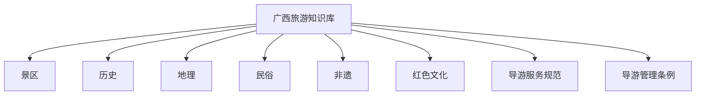

### 8.2 知识条目结构（JSON）

```json
{
  "id": "gx_scenic_lijiang",
  "category": "景区",
  "source": "广西/景区/漓江",
  "title": "漓江",
  "content": "漓江是桂林山水的代表，被誉为'百里画廊'……",
  "tags": ["桂林", "喀斯特", "线路核心节点"],
  "embedding": "[0.013, -0.082, ...]",
  "updated_at": "2026-06-01"
}
```

### 8.3 检索流程

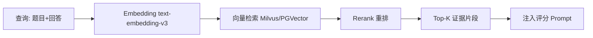

MVP 采用关键词检索（`app/core/knowledge_base.py`），接口与向量库一致，便于平滑替换。

---

## 9. Prompt 工程设计

完整实现见 `app/core/prompts.py`。要求模型严格返回 JSON。

### 9.1 System Prompt（节选）

```
你是一名拥有10年以上经验的导游资格面试评委与AI测评专家。
1. 只依据提供的转写/多模态/知识库证据评分，不臆测。
2. 每项扣分必须给出扣分原因和引用证据。
3. 分数落在允许区间内，不超过满分。
4. 输出必须是合法 JSON。
5. AI 仅建议，给出 confidence(0~1)。
6. 保持评分校准一致性。
```

### 9.2 Scoring Prompt（结构）

注入：维度定义 + 评分项 + 等级 → 题目 → 回答转写 → 多模态特征 → 标准答案 → RAG 证据 → 输出 JSON Schema。

### 9.3 Evaluation / Evidence / Review Prompt

- Evaluation：内容类维度的要点覆盖与事实核对。
- Evidence：要求每个结论绑定 `{type, content, ref}` 证据。
- Review：汇总各维度，生成评语、优点、改进建议、一致性风险标记。

---

## 10. AI 评分校准机制

防止「评分漂移 / 批次不一致 / 重复评分差异过大」：

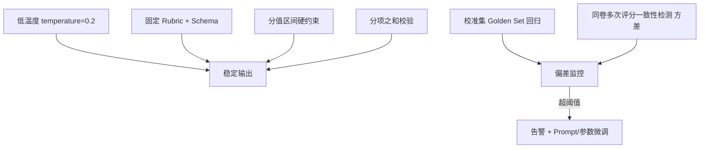

| 机制 | 实现 | 代码位置 |
| --- | --- | --- |
| 区间约束 | 分数截断到 [0, max] | `scoring_engine._normalize` |
| 分项校验 | 分项之和与总分一致性 | `scoring_engine._normalize` |
| 低随机性 | temperature=0.2 + json_object | `bailian_client` |
| 校准集回归 | 定期用专家标注集回归，统计 MAE/一致率 | 运营平台（阶段三） |
| 一致性检测 | 同份回答多次评分方差监控 | 运营平台（阶段三） |

---

## 11. AI 可解释性与证据链设计

每个分数可逐级追溯：

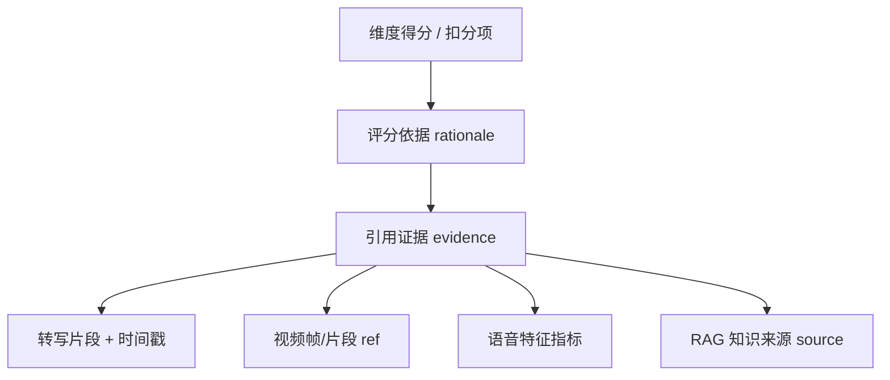

证据对象：`{ "type": "transcript|video|audio|rag", "content": "...", "ref": "时间戳/段落/KB来源" }`。
API `/interviews/{id}/evidence` 输出完整证据链，供评委复核台高亮回放。

---

## 12. 技术架构设计

### 12.1 系统总体架构

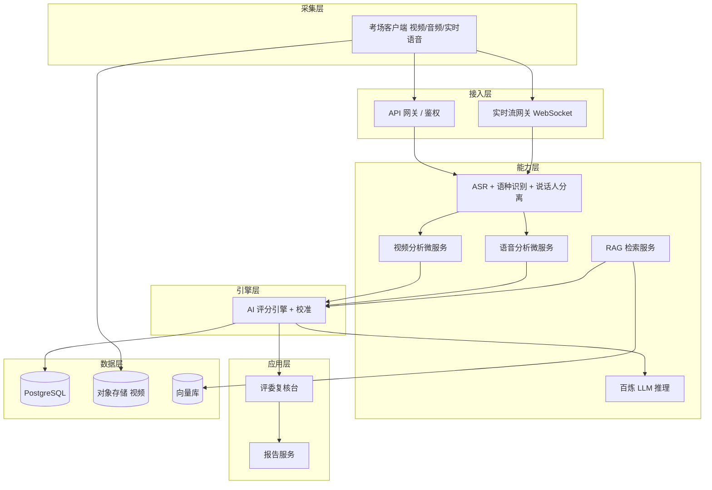

### 12.2 模块架构

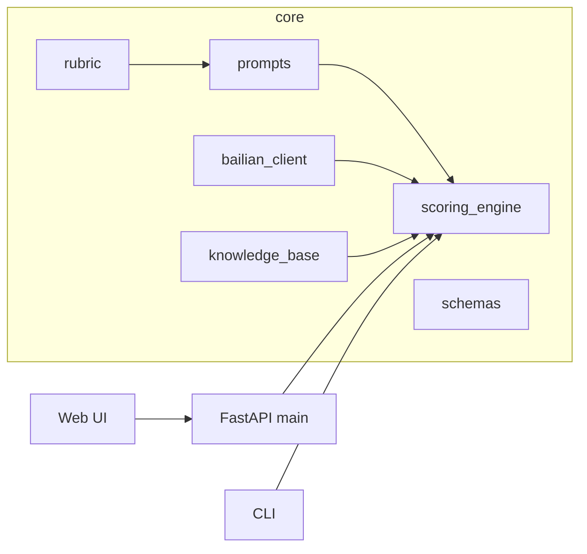

### 12.3 实时评分流程

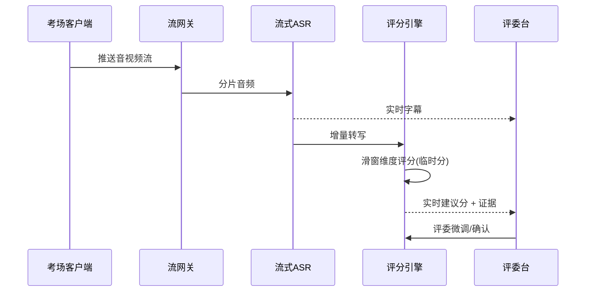

### 12.4 离线评分流程

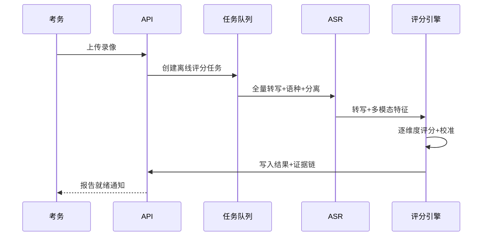

---

## 13. 数据库设计

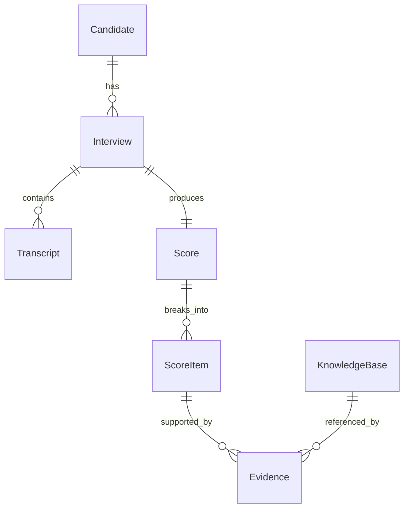

### 13.1 核心表（字段级）

**Candidate**

| 字段 | 类型 | 说明 |
| --- | --- | --- |
| id | UUID PK | 考生 ID |
| name | VARCHAR(64) | 姓名 |
| candidate_no | VARCHAR(32) UNIQUE | 考号 |
| position | VARCHAR(32) | 报考岗位 id |
| language | VARCHAR(16) | 主语言 |
| created_at | TIMESTAMP | |

**Question（题库）**

| 字段 | 类型 | 说明 |
| --- | --- | --- |
| id | UUID PK | 题目 ID |
| position | VARCHAR(32) | 所属岗位 |
| dimension_key | VARCHAR(32) | 所属维度 |
| variant | INT | 套题序号 |
| content | TEXT | 题干 |
| key_points | JSONB | 采分点（问答类）|
| forbidden | JSONB | 违规点 |
| reference | TEXT | 参考答案 |

**Interview**

| 字段 | 类型 | 说明 |
| --- | --- | --- |
| id | UUID PK | 面试 ID |
| candidate_id | UUID FK | 关联考生 |
| mode | VARCHAR(16) | realtime / offline |
| status | VARCHAR(16) | created/scoring/reviewed/finalized |
| video_url | TEXT | 录像对象存储地址 |
| started_at / ended_at | TIMESTAMP | |

**Transcript**

| 字段 | 类型 | 说明 |
| --- | --- | --- |
| id | UUID PK | |
| interview_id | UUID FK | |
| dimension_key | VARCHAR(32) | 所属维度 |
| speaker | VARCHAR(16) | 说话人标识 |
| role | VARCHAR(16) | examiner / candidate |
| excluded | BOOLEAN | 是否被剔除（考官读题）|
| exclude_reason | VARCHAR(32) | examiner_label / question_reading |
| language | VARCHAR(16) | 识别语种 |
| text | TEXT | 转写文本 |
| start_ms / end_ms | INT | 时间戳（证据定位）|

**Score**

| 字段 | 类型 | 说明 |
| --- | --- | --- |
| id | UUID PK | |
| interview_id | UUID FK | |
| total_score | INT | 总分（整数）|
| overall_level | VARCHAR(16) | |
| engine_mode | VARCHAR(16) | bailian/mock |
| review_json | JSONB | 总体评语 |
| confirmed_by | UUID | 评委 ID（终审）|
| created_at | TIMESTAMP | |

**ScoreItem**

| 字段 | 类型 | 说明 |
| --- | --- | --- |
| id | UUID PK | |
| score_id | UUID FK | |
| dimension_key | VARCHAR(32) | |
| item_key | VARCHAR(32) | 评分项（可空）|
| question | TEXT | 该维度所答题目 |
| max_score | INT | 满分（整数）|
| ai_score | INT | AI 建议分（整数）|
| final_score | INT | 评委确认分（整数）|
| level | VARCHAR(16) | |
| deductions_json | JSONB | 扣分项 |
| rationale | TEXT | 评分依据 |
| confidence | NUMERIC(3,2) | |

**Evidence**

| 字段 | 类型 | 说明 |
| --- | --- | --- |
| id | UUID PK | |
| score_item_id | UUID FK | |
| type | VARCHAR(16) | transcript/video/audio/rag |
| content | TEXT | 证据内容 |
| ref | VARCHAR(128) | 时间戳/段落/KB 来源 |
| kb_id | VARCHAR(64) | 关联知识条目（可空）|

**KnowledgeBase**

| 字段 | 类型 | 说明 |
| --- | --- | --- |
| id | VARCHAR(64) PK | |
| category | VARCHAR(32) | 景区/历史/… |
| source | VARCHAR(128) | 来源路径 |
| title | VARCHAR(128) | |
| content | TEXT | |
| tags | TEXT[] | |
| embedding | VECTOR(1024) | 向量 |
| updated_at | TIMESTAMP | |

---

## 14. API 设计

> Demo 已实现简化版（一步式 `/interviews`）。下为生产 REST 设计。

| 方法 | 路径 | 说明 |
| --- | --- | --- |
| GET | `/api/v1/positions` | 岗位列表 |
| GET | `/api/v1/positions/{id}/paper?variant=` | 按岗位生成试卷（每位考生题目可不同）|
| POST | `/api/v1/interviews` | 创建面试（含岗位）|
| POST | `/api/v1/interviews/{id}/video` | 上传视频（离线）|
| POST | `/api/v1/interviews/{id}/transcribe` | 实时/触发转写 |
| POST | `/api/v1/interviews/{id}/score` | 触发评分 |
| GET | `/api/v1/interviews/{id}/score` | 获取评分 |
| GET | `/api/v1/interviews/{id}/evidence` | 获取证据链 |
| POST | `/api/v1/interviews/{id}/confirm` | 评委确认/调整 |
| GET | `/api/v1/interviews/{id}/report` | 生成报告 |

### 14.1 创建面试

```http
POST /api/v1/interviews
{
  "candidate": {"name": "张三", "candidate_no": "GX2026-001", "position": "guide_zh", "language": "zh"},
  "mode": "offline"
}
→ 201 {"interview_id": "4cd469a11ab8", "status": "created"}
```

转写提交时可携带带说话人标注的原文，系统自动剔除考官读题：

```json
{
  "dimension_key": "knowledge_qa",
  "question": "请介绍广西的世界遗产",
  "answer_transcript": "考官：请介绍广西的世界遗产。\n考生：灵渠是世界灌溉工程遗产，壮族三月三是国家级非遗。"
}
```

### 14.2 获取评分（响应）

见 §3.2 JSON 示例。

### 14.3 实时转写（WebSocket）

```
WS /api/v1/interviews/{id}/stream
→ 客户端推送音频分片
← 服务端返回 {"type":"caption","language":"zh","speaker":"S1","text":"...","start_ms":1200}
```

### 14.4 评委确认

```http
POST /api/v1/interviews/{id}/confirm
{
  "items": [{"score_item_id": "...", "final_score": 8.5, "comment": "认可AI建议"}],
  "confirmed_by": "judge-007"
}
→ 200 {"status": "finalized", "final_total": 80.0}
```

---

## 15. 非功能设计

| 类别 | 要求 |
| --- | --- |
| 性能 | 离线单场评分 < 30s（不含转写）；实时建议分端到端延迟 < 3s |
| 并发 | 支持 ≥ 50 路考场并发；评分引擎水平扩展（无状态 + 队列）|
| 可用性 | 服务可用性 ≥ 99.9%；LLM 失败自动降级/重试 |
| 安全 | 全链路 HTTPS/TLS；RBAC 权限；操作审计日志 |
| 数据合规 | 人脸/录像加密存储；最小化留存与定期清理；采集前授权告知；符合《个人信息保护法》 |
| 评分准确率 | 见验收标准 |
| 可解释 | 100% 分数可回溯证据链 |

---

## 16. 验收标准

| 指标 | 目标 | 验证方法 |
| --- | --- | --- |
| ASR 准确率（中文） | 字准确率 ≥ 95% | 标注集测试 |
| ASR 准确率（外语） | 词准确率 ≥ 90% | 多语种标注集 |
| 语种识别准确率 | ≥ 98% | 多语种样本 |
| 视频识别准确率（着装/表情/姿态） | ≥ 90% | 标注帧测试 |
| 考官读题剔除准确率 | ≥ 98%（不误删考生内容）| 标注转写测试 |
| 评分取整 | 所有分数/扣分为整数 | 自动校验 |
| AI 评分一致性（重测） | 同卷多次评分总分方差 ≤ 2 分 | 重复评分回归 |
| AI 与专家评分一致率 | 总分 MAE ≤ 5 分；维度等级一致率 ≥ 85% | 专家标注校准集 |
| 证据链完整性 | 100% 分数含 ≥1 条证据 | 自动校验 |
| 系统性能 | 满足 §15 指标 | 压测 |

### 验收用例（节选）

1. 上传一份标准录像 → 30s 内产出建议分与证据链；每项扣分均含原因+证据。
2. 同一份回答重复评分 5 次 → 总分极差 ≤ 2 分（校准达标）。
3. 与 3 名专家盲评对比 → 总分 MAE ≤ 5、等级一致率 ≥ 85%。
4. 评委在复核台调整某项分数 → 终审分与留痕正确落库。
