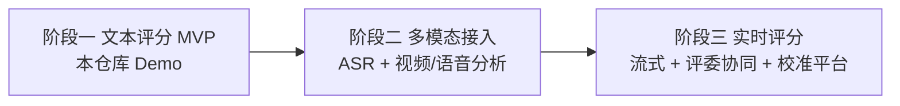

# AI 辅助导游面试评分系统 · 快速实现方案

> 目标：用最小成本验证「AI 辅助判分」的可行性与可解释性，再渐进式扩展到多模态、实时评分的完整系统。

## 1. 总体策略：三阶段演进

| 阶段 | 周期 | 范围 | 产出 |
| --- | --- | --- | --- |
| 一 · MVP（本 Demo） | 1~2 周 | 文本评分引擎 + 7 维 Rubric + RAG + Prompt + 证据链 + API/UI | 可演示、可评审 |
| 二 · 多模态 | 3~5 周 | 接入百炼 ASR（Paraformer）+ 视频/语音分析微服务，离线评分全链路 | 端到端离线评分 |
| 三 · 实时 & 平台化 | 6~8 周 | 流式 ASR + 实时评分 + 评委复核台 + 评分校准看板 | 生产可用 |

## 2. MVP（本 Demo）范围

聚焦「内容 + 问答」类评分（占总分 65 分：线路讲解 25 + 景区讲解 25 + 三类问答 30），形象礼仪/语言表达先用多模态特征 JSON 占位（阶段二替换为真实视频/语音分析输出）。

- 评分体系：`app/core/rubric.py` 完整还原 7 维 100 分标准与等级。
- AI 推理：`app/core/bailian_client.py` 走百炼 OpenAI 兼容接口；无 Key 时启发式 mock。
- RAG：`app/core/knowledge_base.py` 内置广西文化 + 服务规范知识，关键词检索（生产替换向量库）。
- 可解释：每分项输出扣分原因 + 引用证据 + 置信度，`/interviews/{id}/evidence` 暴露证据链。

## 3. 技术选型

| 能力 | MVP 选型 | 生产演进 |
| --- | --- | --- |
| LLM | 阿里百炼 Qwen-Plus（OpenAI 兼容） | Qwen-Max / 微调模型 |
| ASR | （占位）| 百炼 Paraformer 多语种 + 语种识别 + 说话人分离 |
| 视频分析 | （占位特征 JSON）| 人脸/姿态/表情/着装检测微服务（如 MediaPipe / 自研 CV） |
| RAG 检索 | 内存关键词 | text-embedding-v3 + Milvus / PGVector |
| 后端 | FastAPI + Uvicorn | FastAPI + Celery 异步 + 对象存储 |
| 存储 | 内存字典 | PostgreSQL + 对象存储（视频）|
| 前端 | 原生 HTML 单页 | React 评委复核台 |

## 4. 落地里程碑（MVP 已完成项）

- [x] 评分体系建模（7 维 / 100 分 / 等级）
- [x] Prompt 工程（System / Scoring / Review）
- [x] 百炼客户端 + mock 降级
- [x] RAG 知识库 + 检索
- [x] 评分引擎（校准 + 证据链汇总）
- [x] REST API + Web UI + CLI demo
- [ ] （阶段二）接入真实 ASR / 视频分析
- [ ] （阶段二）向量化 RAG + 标准答案库扩充
- [ ] （阶段三）流式实时评分 + 评委复核台 + 校准看板

## 5. 风险与对策

| 风险 | 对策 |
| --- | --- |
| AI 评分漂移 / 批次不一致 | 低温度 + 固定 Rubric + 分值区间约束 + 校准集回归（见设计文档 §AI评分校准） |
| 幻觉 / 无依据打分 | 强制引用证据，RAG 提供事实依据，证据缺失则降置信度 |
| 多语种识别 | 阶段二接入百炼多语种 ASR + 自动语种检测 |
| 合规（人脸/录像） | 数据加密、最小化留存、用途告知与授权（见设计文档 §非功能） |
| AI 误判影响考生 | AI 仅建议，评委终审，分歧留痕可追溯 |
